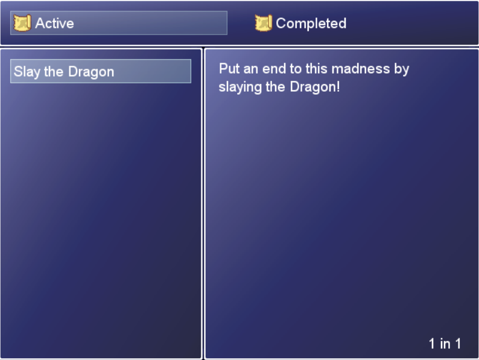
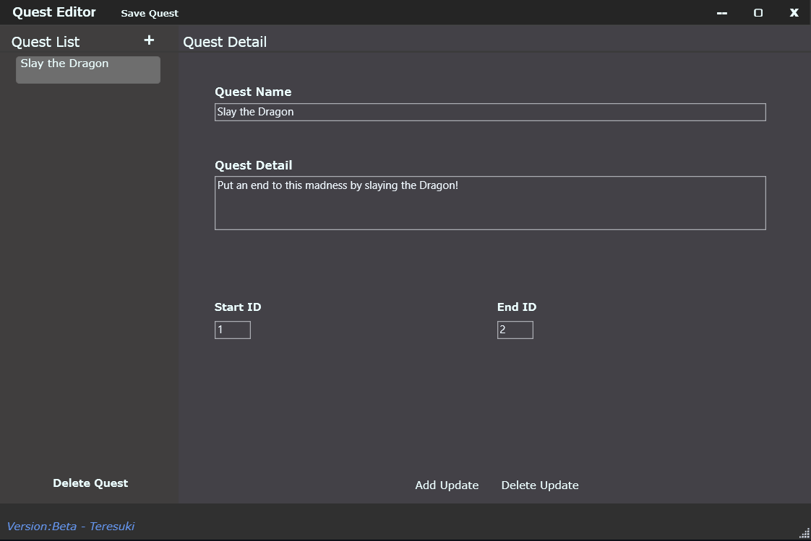

# Introduction
RPG Maker XP does not come out of the box with a way to add quests to your game, so I have written some ruby scripts (RGSS in the context of RPGM XP). These scripts remove the steps count window and add the quest menu option to the menu screen.

However, add a quest through a ruby script file is troublesome and prone to user's syntax errors. A WPF (Windows Presentation Foundation, .NET) desktop app is created to help user create new quests (and its updates) through a GUI.

Quests data read by the Quest Editor is stored in JSON format, and then written in ruby scripts to let RPGMXP game read and load the quests.

## Installation Guide
Please head to the Release tab to read the installation instruction and download the Ruby scripts & Quest Editor.
