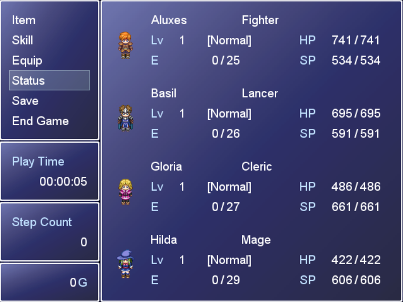
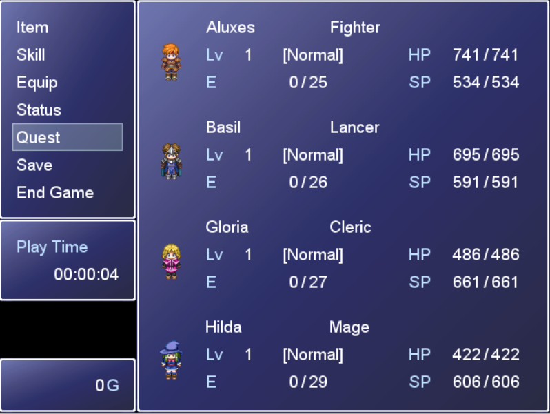

# Introduction
RPG Maker XP does not come out of the box with a way to add quests to your game, so I have written some ruby scripts (RGSS in the context of RPGM XP). These scripts remove the steps count window and add the quest menu option to the menu screen.

